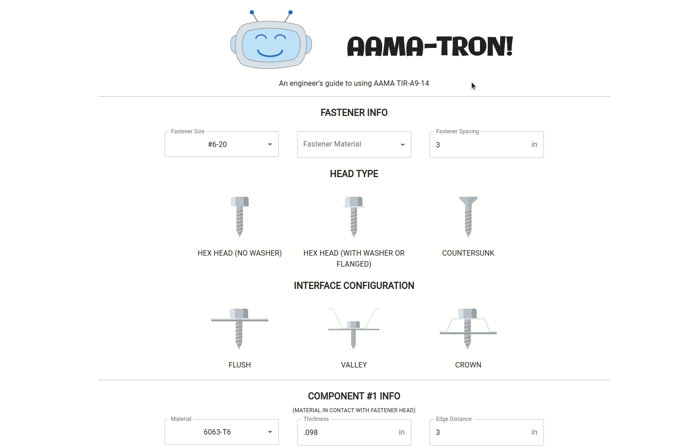

# CURTAIN WALL FASTENER CALCULATOR

This project provides metal fastener capacities in accordance with AAMA TIR-A9-14.

It was created by Ken Metz, PE (licensed in MD & OR at time of development). He can be contacted at Kenneth.E.Metz@gmail.com.

[Live site can be found here](https://kennethmetz.github.io/fastener-calculator/)

 

## BACKGROUND:

This project aims to ease the learning curve present in the application of AAMA TIR-A9-14 in the design of metal fasteners. This web app is meant to assist in the education of any engineer who is new to this design document (AAMA TIR-A9-14). It is to be used solely for educational purposes.

## SCOPE:

Note, the following use cases are **NOT** covered by this calculator:

- Metric fasteners
- Screws larger than 3/8" diameter
- Bolts
- Carbon steel, stainless steel, or cold-formed steel base material
- Screws in oversized holes
- Screws interfacing with screw chases (Ref. Section 13 & 14 of AAMA TIR-A9-14 for more information)
- Screw tilting for screws larger than 1/4" diameter

## TECHNOLOGIES USED:

- React
- Material UI
- Jest (Unit Testing)
- React-Hook-Form (form validation)
- Yup (form validation)

### Attributions:

Artwork inspiration provided by:

- julygal88450431 on [Vecteezy](https://www.vecteezy.com/free-vector/screw")
- sleepy panda on [Vecteezy](https://www.vecteezy.com/free-vector/robot")

### Licensing:

**This program is under the GNU AGPL license. Please see COPYING.txt file for additional information.**
